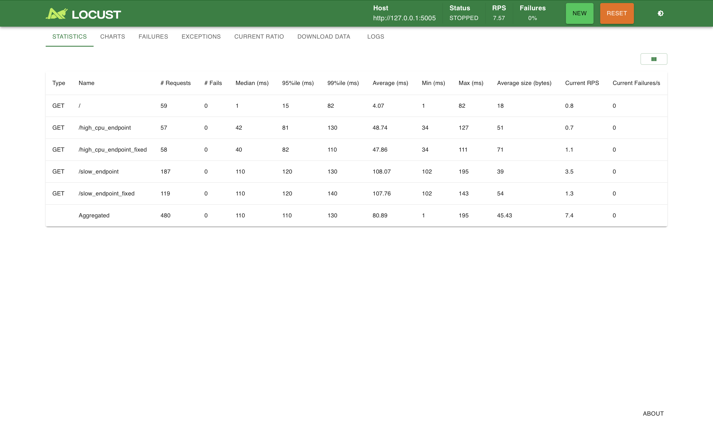
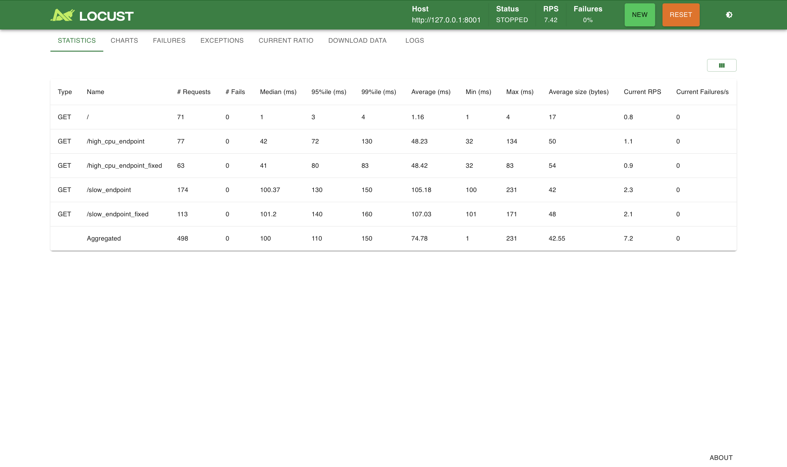

# ЛР-13

##  Конфигурация тестирования
- Инструмент: Locust 2.44.4
- Конфигурация: 10 пользователей, Ramp up: 2
- Тестируемые фреймворки: FastAPI, Flask, Tornado, Sanic

## Результаты тестирования

- ### FastAPI (порт 8000)

- ### Flask (порт 5005)

- ### Tornado (порт 8888)

- ### Sanic (порт 8001)

## Сравнительный анализ

| Фреймворк | /high_cpu_endpoint (P95) | /high_cpu_endpoint_fixed (P95) | Общий RPS | Ошибки |
|-----------|--------------------------|-------------------------------|-----------|--------|
| **FastAPI** | 370 ms | 370 ms | 0.7 | 0% |
| **Flask** | 81 ms | 82 ms | 7.4 | 0% |
| **Tornado** | 75 ms | 78 ms | 7.5 | 0% |
| **Sanic** | 72 ms | 80 ms | 7.2 | 0% |

